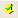
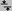
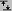
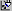
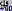
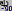
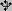
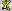
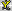

'# Menus and toolbars

There are several ways in which a user may interact with MIFit:

> via keyboard shortcuts

> via menu items

> via toolbar items

Keyboard shortcuts are discussed in Chapter 4. In this chapter we discuss and compare menu and toolbar items. Not all menu items have equivalent toolbar items but essentially all toolbar items have equivalents from amongst the menu items.

In addition, a right mouse click in the main or navigator canvas areas makes a context menu available. This menu contains frequently used menu items that are otherwise distributed among several main menus.

**3.1 Startup menu / toolbar**

**images/image018.gif** File/New**Create a new structure document

**images/image020.gif** File/Open models, data, maps, etc**Open an existing structure document

**images/image022.gif** File/Save Session, File/Save Session As**Save a structure document

**images/image024.gif** File/Print**Print the canvas

**images/image026.gif** File/Copy Canvas**Copy the canvas to the clipboard

(Windows only)

Table 3.1 Menu and toolbar items available at startup

Table 3.1 shows the toolbar items and their menu item equivalents that are available when MIFit is first started. The **File/Save Session**, **File/Save Session As**and **File/Print**menu items are initially inactive.

**3.2 General menu / toolbar**

Once an existing structure document has been opened or a new structure document been created, the menu and the toolbar expand to contain more items. Table 3.2 shows the additional toolbar items and their menu equivalents. These additional toolbar items are appended to the items listed in Table 3.1. The additional menu bar items are inserted between the **File** and **Help** pull down menu bar items on Linux systems and between the **File** and **Window** pull down menu bar items on Windows systems.

 **Show/Annotation/Add annotation to model** Add annotation at canvas center

 **Model/Checkpoint Model** Save model state in PDB format file

 **Viewpoint/Slab In**Decrease display depth in z-direction

 **Viewpoint/Slab Out**Increase display depth in z-direction

 **Viewpoint/Zoom Out** Zoom out to expand view of model

 **Viewpoint/Zoom In**Zoom in to shrink view of model

 **Viewpoint/Top View** Display view down z-axis

 **Viewpoint/Rotate View +90** Rotate about y by +90

 **Viewpoint/Rotate View -90**Rotate about y by -90

 **Viewpoint/Decrease Perspective**Decrease canvas perspective

 **Viewpoint/Increase Perspective** Increase canvas perspective

Table 3.2 General toolbar items and their menu equivalents

**3.3 Modeling menu / toolbar**

The items in the modeling portion of the toolbar are initially active. When an atom is selected in the canvas with a mouse click, the **Fit Residue**option becomes active. When this item is activated or when the **Fit/Fit Residue**command is selected all the **Fit**items except for **Fit/Torsion**are activated. The **Fit/Torsion**option becomes active when a bond defining a torsion angle has been selected.

 **Fit/Fit Residue** Fit residue containing top-of-stack atoms

 **Fit/Apply**   Apply modifications to selected residue(s)

 **Fit/Cancel**  Cancel all modifications

 **Fit/Translate**  Switch to translating selected residue(s)

 **Fit/Rotate**  Switch to rotating selected residue(s)

 **Fit/Torsion** Apply torsion motion to selection

 **Fit/Center** Right mouse button pans viewpoint

Table 3.2 Modeling toolbar items

When the model is modified and the **Fit/Accept Fit**command is selected the **Save file**toolbar item and the analogous menu items **File/Save Session**and **File/Save Session As**become active.

**3.4 Display menu / toolbar**

 **Render/Color**  Color Tool

 **Show/Atoms or Show/Residues** Show Tool

 **Show/Sidechains** Show Side chain Tool

 **Show/Atoms or Show/Residues** Hide Tool

Table 3.4 Display toolbar items

Color selection capabilities may be accessed with the **Render/Color**menu options or with the **Color Tool**toolbar item.
